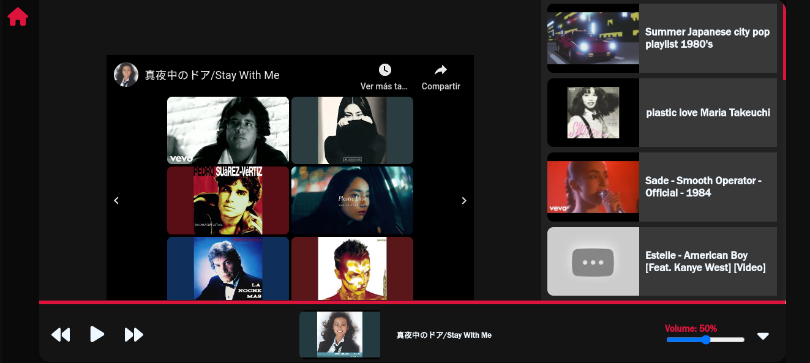

# YouTube Video Player in ReactJS

Este proyecto es un reproductor de videos de YouTube construido con **ReactJS**. Permite a los usuarios buscar, ver y controlar la reproducción de videos directamente desde la interfaz de la aplicación. Se integra con la API de YouTube para proporcionar una experiencia fluida y moderna.


## Url del video en youtube
[video youtube](https://youtu.be/eQlewUEDmng)
## Preview del proyecto

<iframe width="560" height="315" src="https://www.youtube.com/embed/eQlewUEDmng?si=iE9KdtorVBj17yOa" title="YouTube video player" frameborder="0" allow="accelerometer; autoplay; clipboard-write; encrypted-media; gyroscope; picture-in-picture; web-share" referrerpolicy="strict-origin-when-cross-origin" allowfullscreen></iframe>

## Características

- Búsqueda de videos de YouTube a través de la API.
- Reproducción de videos con controles básicos.
- Diseño intuitivo y responsivo.
- Carga dinámica de miniaturas de videos.
- Soporte para la reproducción en pantalla completa.

## Demo

Si deseas ver el proyecto en acción, puedes visitar la **demo** en [URL_DE_LA_DEMO].

## Requisitos

Asegúrate de tener instalados los siguientes programas en tu sistema:

- **Node.js** (LTS recomendado)
- **npm** (Node Package Manager)

## Instalación

Sigue estos pasos para clonar el repositorio y configurar el proyecto localmente:

1. Clona el repositorio a tu máquina local:

   ```bash
   git clone https://github.com/tu_usuario/reproductor-youtube-react.git
2. Navega al directorio del proyecto:
   
   ```bash
   cd reproductor-youtube-react
3. Instala las dependencias del proyecto usando npm:

   ```bash
   npm install
4. Inicia la aplicación en modo de desarrollo:

   ```bash
   npm run dev   

# Uso

Una vez que la aplicación esté en funcionamiento, podrás buscar videos de YouTube utilizando el cuadro de búsqueda en la parte superior de la pantalla. Los resultados aparecerán como una lista de videos, cada uno con su respectiva miniatura.

Haz clic en cualquiera de los videos para comenzar a reproducirlo en el reproductor. Puedes pausar, reproducir, adelantar y retroceder el video usando los controles disponibles en la interfaz.

# API de YouTube

Este proyecto hace uso de la API de YouTube Data v3 para realizar las búsquedas de videos y recuperar información sobre cada uno de ellos. Necesitarás obtener una clave API de YouTube para poder usarla en tu aplicación.

1. Ve a la Consola de Google Cloud.
2. Crea un nuevo proyecto.
3. Habilita la API de YouTube Data v3.
4. Obtén tu API Key.
5. Agrega la clave en el archivo de configuración correspondiente (por ejemplo, src/services/youtubeAPI.js).

    ```javascript
    const API_KEY = 'TU_API_KEY_AQUI';

# Contribuciones

Las contribuciones son bienvenidas. Si deseas mejorar el proyecto, sigue estos pasos:

1. Haz un fork del repositorio.
2. Crea una rama para tus cambios (git checkout -b mi-nueva-funcionalidad).
3. Haz tus cambios y haz commit de ellos (git commit -am 'Agrega nueva funcionalidad').
4. Haz push de tu rama (git push origin mi-nueva-funcionalidad).
5. Abre un pull request describiendo los cambios.

# Licencia
Este proyecto está bajo la licencia MIT.